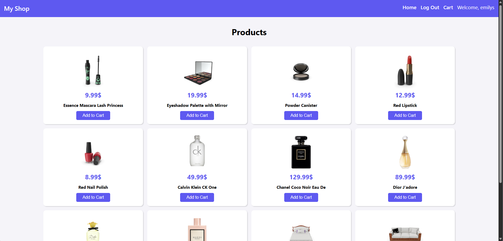
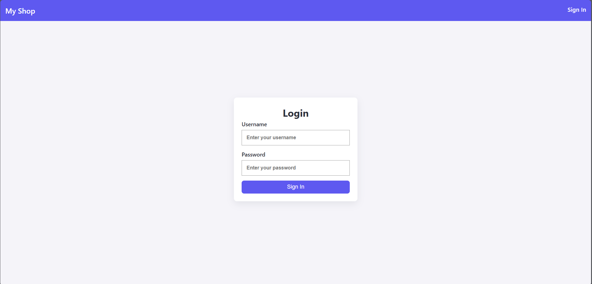
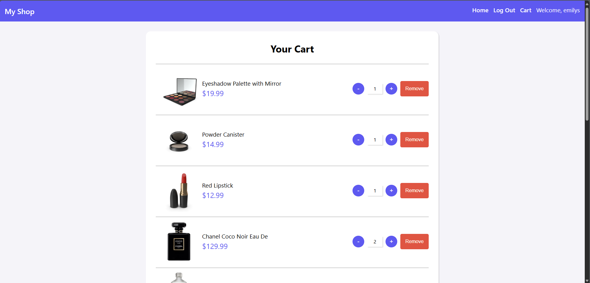

## 📦 **Objective**

Develop a simple E-commerce web application using React.js and the DummyJSON API:  
🔗 [https://dummyjson.com/docs/products](https://dummyjson.com/docs/products)  
The project demonstrates working with APIs, managing authentication, handling routing, and implementing basic state management with React Context.

---

## ✅ **Requirements**

### 🔹 **1. Navbar**

Every page includes a responsive navbar with:

- **Logo**: Simple logo or text.
- **Home**: Links to the homepage.
- **Cart**: Shown **only when the user is logged in**.
- **User Name**: Displayed **only when the user is logged in**.
- **Sign In**: Displayed **only when the user is not logged in**.
- **Logout**: Displayed when the user is logged in.
    - There is no logout endpoint. Logging out clears the token and user data from local storage and context, and updates the navbar accordingly.

---

### 🔹 **2. Pages**

---

### 🏠 **Home Page**

- Display a list of products from:  
  `https://dummyjson.com/products`
- Use pagination to show 12 products per page.
- Show a **loading spinner or indicator** while fetching data.
- Each product displays:
  - Title
  - Image
  - Price
  - **Add to Cart** button

🛒 **Add to Cart Behavior**
- Adds product to the cart using the API.
- Shows a success message or toast notification.

### 🔐 **Sign In Page**

- Includes:
  - **Username** and **Password** inputs
- Validates input fields.
- Submits to:  
  `POST https://dummyjson.com/auth/login`
- Uses credentials from:  
  `https://dummyjson.com/users`
- On successful login:
  - Store token in local storage
  - Save user data in React context
  - Redirect to **Home Page**
  - Update navbar (show Cart and username)

🔒 Only **logged out** users can access the login page.

---

### 🛒 **Cart Page**

- Fetch cart data from:  
  `https://dummyjson.com/carts/user/{userId}`
- Only accessible to **logged-in users**
- Display for each cart item:
  - Product image
  - Title
  - Quantity
  - Price
  - **+** button: Increase quantity
  - **–** button: Decrease quantity
  - **Remove** button: Delete product from cart

💰 **Total Price** is shown at the bottom.

🛠️ **Cart Actions:**
- **Update Quantity**:
  - Increase, decrease, or remove products
  - Uses:  
    `https://dummyjson.com/carts/{cartId}` (PATCH)

- **Remove All Products**:
  - API:  
    `https://dummyjson.com/carts/user/{userId}`
  - Confirmation modal:
    - Title: “Are you sure you want to delete all products?”
    - Buttons:
      - Yes (confirm)
      - No (cancel)
  - Show a toast message after successful deletion.

---
